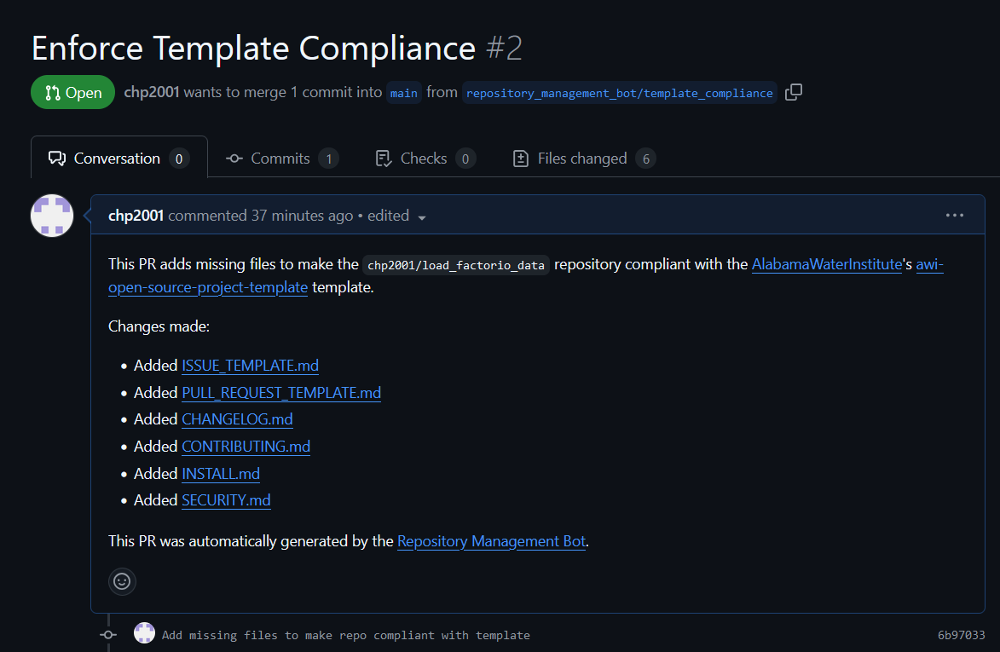

# Repository Management Bot

**Description**:  A bot / script setup that manages repositories organization-wide. As the "bot" is currently a manually run script, it will only take actions when run.

Ideally, the bot would run on a schedule or be triggered by events in the organization, but that is not currently implemented.

The primary (and currently, only) functionality is to enforce templates on existing repositories via automatically generated pull requests.



- **Technology stack**:
  - Language: Python
  - Primary Libraries: PyGithub
  - Interface: GitHub CLI, Command Line
- **Status**:  Alpha (Bare Minimum Functionality)
- **Links**:
  - [GitHub Repository](https://github.com/chp2001/repository-management-bot)

## Dependencies

- Python 3.8+ (Ideally 3.10+) (from [here](https://www.python.org/downloads/))
- PyGithub (from [here](https://pypi.org/project/PyGithub/))
- GitHub CLI (from [here](https://cli.github.com/))

## Installation & Configuration

View the [INSTALL](INSTALL.md) document for detailed instructions on how to install, configure, and get the project running.

## Usage

The primary entry point is in the [`__main__.py`](repository_management_bot/__main__.py) file. It can be run with the following command (from the root of the repository):

```bash
python -m repository_management_bot [--org|-o organization_name] [--template|-t template_repository_name] [--org|-o organization_name] [--repo|-r template_repository_name] [--help|-h]
```

These options interact in the following ways:

- If no template is provided, the program will default to using the `AlabamaWaterInstitute/awi-open-source-project-template` repository.
- A specific repository can be provided with `--repo` or `-r` for the bot to act on that singular repository.
  - If the `organization/` or `user/` prefix of the repository name (typically of the form `owner/repository`) is not provided, one of the two must be provided with their respective flags.
- If an organization is provided without a repository, the bot will act on all repositories in that organization.
- If a user is provided without a repository, the bot will act on all repositories owned by that user.
- The presence of the `--help` or `-h` flag will override all other flags and display the help message, then exit.

For safety, the bot will ask for confirmation at multiple points during the process, allowing the user to either skip a specific repository or cancel the entire operation.

## Known issues

The bot is currently incomplete. Additionally, it can only act through the logged-in user, so it is not suitable for use in a production environment.

The bot is not intended to be run on a single repository multiple times. Although there are safeguards in place to prevent most issues, this is not core functionality and not all interactions are accounted for. There are no known specific issues, but the lack of exhaustive coverage means that repeated or incomplete runs may cause unexpected behavior.

## Getting involved

To get involved, please see the [CONTRIBUTING](CONTRIBUTING.md) document.

----

## Open source licensing info

1. [LICENSE](LICENSE)

----

## Credits and references

1. Dependabot (for inspiration)
