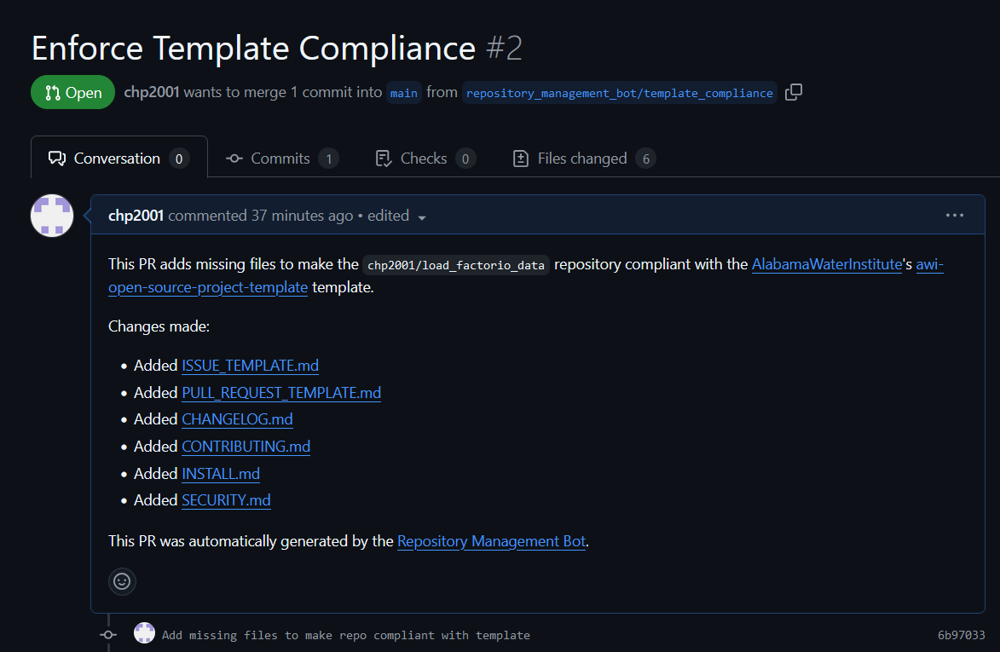

# Repository Management Bot

**Description**:  A bot / script setup that manages repositories organization-wide. As the "bot" is currently a manually run script, it will only take actions when run.

Ideally, the bot would run on a schedule or be triggered by events in the organization, but that is not currently implemented.

The primary (and currently, only) functionality is to enforce templates on existing repositories via automatically generated pull requests.



- **Technology stack**:
  - Language: Python
  - Primary Libraries: PyGithub
  - Interface: GitHub CLI, Command Line
- **Status**:  Alpha (Bare Minimum Functionality)
- **Links**:
  - [GitHub Repository](https://github.com/chp2001/repository-management-bot)

## Dependencies

- Python 3.8+ (Ideally 3.10+) (from [here](https://www.python.org/downloads/))
- PyGithub (from [here](https://pypi.org/project/PyGithub/))
- GitHub CLI (from [here](https://cli.github.com/))

## Installation & Configuration

View the [INSTALL](INSTALL.md) document for detailed instructions on how to install, configure, and get the project running.

## Usage

The primary entry point is in the [`__main__.py`](repository_management_bot/__main__.py) file. It can be run with the following command (from the root of the repository):

```bash
python -m repository_management_bot [organization_name] [template_repository_name] [--org|-o organization_name] [--repo|-r template_repository_name] [--help|-h]
```

## Known issues

The bot is currently incomplete. Additionally, it can only act through the logged-in user, so it is not suitable for use in a production environment.

## Getting involved

To get involved, please see the [CONTRIBUTING](CONTRIBUTING.md) document.

----

## Open source licensing info

1. [LICENSE](LICENSE)

----

## Credits and references

1. Dependabot (for inspiration)
