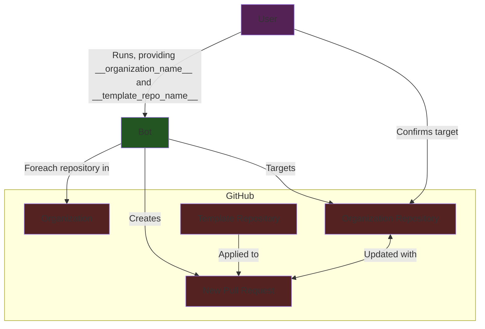
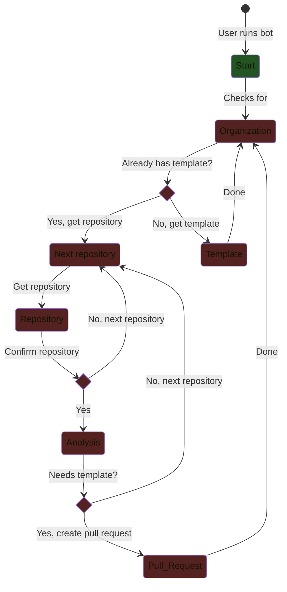

# Methodology

## Table of Contents

1. [Introduction](#introduction)
2. [Implementation Paths](#implementation-paths)
3. [Setup](#setup)
4. [Running the Bot](#running-the-bot)

## Introduction

This document describes the methodology of the Repository Management Bot.

A bot / script setup that manages repositories organization-wide. As the "bot" is currently a manually run script, it will only take actions when run.

Ideally, the bot would run on a schedule or be triggered by events in the organization, but that is not currently implemented.

## Implementation Paths

GitHub has two primary ways to interact with data: the GitHub API and the GitHub CLI.

The GitHub API allows any program to interact with data through HTTP requests.

The GitHub CLI is a command-line interface that allows for interaction with GitHub repositories.

This bot uses parts of both to interact with repositories, as the GitHub CLI is more user-friendly for some tasks.

```mermaid
graph TD
    U[User]
    A[Bot]
    B[GitHub API]
    C[GitHub CLI]
    D[GitHub]
    U --> |Requests| A
    A --> |Returns| U
    A --> C
    A --> B
    B --> |HTTP Requests| D
    C --> |Command Line| D
    B --> |API data| A
    C --> |CLI data| A
    style U fill:#525
    style A fill:#252
    style B fill:#522
    style C fill:#225
    style D fill:#255
```



Of note, however, is that GitHub has several automation frameworks available, such as GitHub Actions. GitHub Actions may allow for automation of the bot, or various related tasks, in the future, but that is not currently implemented.

```mermaid
graph TD
    U[User]
    subgraph repo [Repository]
        direction TB
        A[Bot]
        B[GitHub Actions]
    end
    subgraph github [GitHub]
        direction TB
        C[GitHub CLI]
        D[GitHub API]
        E[GitHub]
        F[GitHub Events]
    end
    U --> |Sets up somehow?| repo
    F --> |Triggers? Repo created or updated?| B
    B --> |Runs?| A
    A --> |Uses| C
    A --> |Uses| D
    C --> |Command Line| E
    D --> |HTTP Requests| E
    U --> |Sets up somehow?| F
    style U fill:#525
    style A fill:#252
    style B fill:#522
    style C fill:#225
    style D fill:#255
    style E fill:#255
    style F fill:#522
```



GitHub Actions are primarily command-line scripts that run on GitHub servers. This conflicted with designing the bot, as testing the bot would require running it locally. It is very likely that the bot could be run through GitHub Actions, but that needs to be explored further.

## Setup

The bot is a Python script that uses the `PyGithub` library and GitHub CLI tool to interact with GitHub.

To use, the user must authenticate with GitHub using the GitHub CLI tool. The bot will then use the authenticated user's credentials to interact with GitHub. The bot is run from the command line, and the user can pass in arguments to specify which repositories to act upon. The bot will then take actions on the specified repositories.

```bash
gh auth login
python -m repository_management_bot --help
```



In the above diagram, the user runs the bot, providing the organization name and template repository name. The bot then chooses a repository in the organization to act upon. The user confirms (or denies) the target repository, and the bot then creates a new pull request. The pull request is created on a fork or branch of the target repository using the structure of the template repository.

## Running the Bot

The bot follows a simple logic flow:



1. The bot starts by checking the organization and getting the template repository.
2. It then gets the first repository in the organization and confirms the user wants to act on it.
3. If the user confirms, the bot checks if the repository needs the template.
4. If it does, the bot creates a new pull request.
5. The bot then moves on to the next repository in the organization. (Back to step 2)

It's important to note that when running the bot locally, the user can cancel the bot at any time; either inputting a `q` when asked for input or using a keyboard interrupt (`Ctrl+C`).
